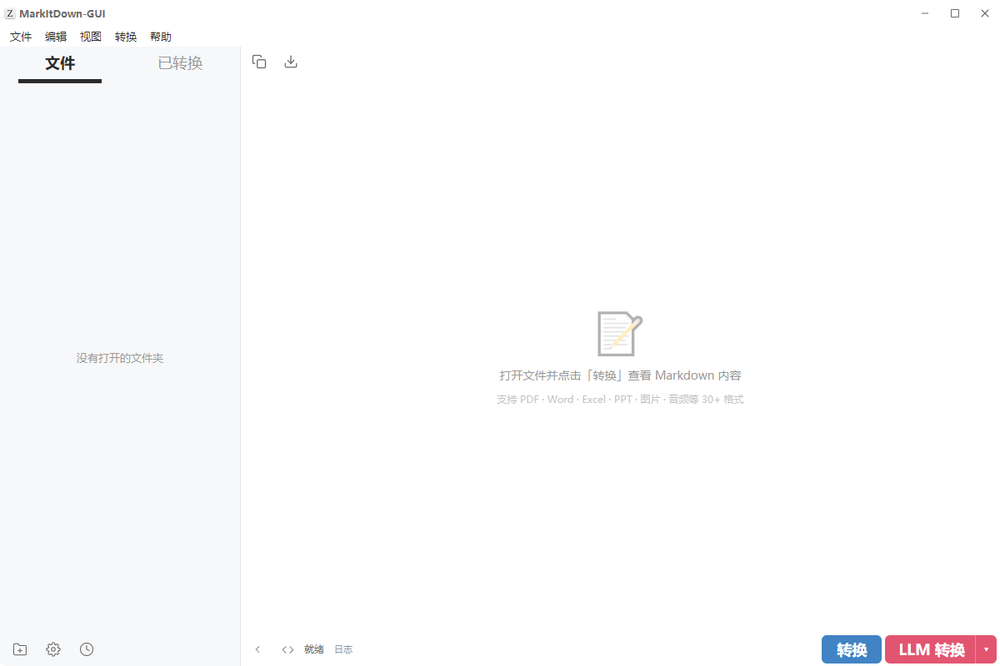

# MarkItDown GUI

文件转 Markdown 桌面工具，支持 LLM 增强处理。

作者：**JJCKA**

---

## 功能

- 30+ 文件格式转 Markdown（PDF、Word、Excel、PPT、图片、音频、ZIP 等）
- LLM 增强：图片描述、音频转录、全文总结、复杂表单清洗
- Typora 风格极简界面，所见即所得 Markdown 预览
- 多选批量转换，SSE 实时进度推送


## 软件截图



## 技术栈

| 层 | 技术 |
|---|------|
| 桌面壳 | Electron |
| 前端 | React 18 + TypeScript + Zustand + marked |
| 后端 | Python 3.13 + FastAPI + markitdown + httpx |
| 打包 | PyInstaller + electron-builder |

## 免责声明

- 本项目仅用于个人学习与编程练习，不涉及任何商业用途。
- 界面设计模仿 Typora 的极简风格，但所有代码均为独立编写，未使用 Typora 的任何源代码、资源文件或商标资产。
- 如有版权或商标方面的顾虑，请联系作者。

## 开发环境

- Node.js >= 18
- Python >= 3.10

```bash
# 创建虚拟环境
python -m venv MDGUI
MDGUI\Scripts\activate

# 后端依赖
pip install -r requirements.txt

# 前端依赖
npm install

# 启动开发
npm run electron:dev
```

## 项目结构

```
markitdown-ui/
│
├── electron/                          # Electron 主进程
│   ├── main.ts                        #   窗口管理、Python 进程生命周期
│   └── preload.ts                     #   IPC 桥接，暴露安全的 electronAPI
│
├── src/                               # React 前端
│   ├── main.tsx                       #   入口，挂载 <App/>
│   ├── App.tsx                        #   根布局：标题栏+菜单+侧边栏+内容区
│   ├── global.d.ts                    #   electronAPI 的 TypeScript 类型声明
│   ├── vite-env.d.ts                  #   Vite 客户端类型引用
│   ├── components/
│   │   ├── TitleBar.tsx               #   自定义标题栏（图标+标题+窗口控件）
│   │   ├── MenuBar.tsx                #   菜单栏（文件/编辑/视图/转换/帮助）
│   │   ├── Sidebar.tsx                #   侧边栏容器（标签+文件树+底部操作栏）
│   │   ├── FileTree.tsx               #   文件树（目录懒加载+SVG图标+多选）
│   │   ├── ConvertedList.tsx          #   已转换文件列表
│   │   ├── MilkdownEditor.tsx         #   Markdown 查看器（marked 渲染+源码模式）
│   │   ├── SettingsPage.tsx           #   设置页（LLM 配置+功能开关）
│   │   ├── HistoryPanel.tsx           #   历史记录面板
│   │   ├── BottomBar.tsx              #   底部控制栏（状态/日志/转换按钮）
│   │   ├── LogPanel.tsx               #   折叠日志面板
│   │   └── LLMPopup.tsx               #   LLM 功能快速开关弹窗
│   ├── stores/
│   │   └── appStore.ts                #   Zustand 全局状态（视图/文件/转换/设置）
│   ├── api/
│   │   └── client.ts                  #   后端 API 客户端（HTTP + SSE）
│   ├── hooks/
│   │   └── useKeyboard.ts             #   全局键盘快捷键
│   ├── styles/
│   │   └── theme.css                  #   Typora 风格 CSS 变量主题
│   └── utils/
│       └── path.ts                    #   前端路径工具函数
│
├── backend/                           # Python FastAPI 后端
│   ├── main.py                        #   应用入口，注册路由，启动 uvicorn
│   ├── api/
│   │   ├── convert.py                 #   转换端点（/api/convert/*，含 SSE）
│   │   └── settings.py                #   设置端点（/api/settings/*）
│   ├── core/
│   │   ├── config.py                  #   JSON 持久化配置管理
│   │   ├── converter.py               #   转换引擎（基础+LLM 增强+图片提取+分块）
│   │   ├── llm_client.py              #   OpenAI 兼容 LLM API 客户端
│   │   └── doc_converter.py           #   .doc → .docx 转换（COM 自动化）
│   ├── prompts/
│   │   └── builtin.py                 #   LLM Prompt 模板+文件扩展名分类
│   └── tests/
│       ├── test_config.py             #   Config 单元测试
│       ├── test_converter.py          #   Converter 纯函数测试
│       └── test_prompts.py            #   Prompt/扩展名测试
│
├── assets/                            # 图标资源
│   ├── icon.png                       #   原始图标（PNG）
│   └── icon.ico                       #   Windows 图标（ICO）
│
├── screenshots/                       # 软件截图
│
├── DOC/                               # 项目文档
│   ├── 01_用户指南.md                 #   安装/配置/使用教程
│   ├── 02_技术架构文档.md             #   系统架构/模块设计/数据流
│   ├── 03_LLM集成与算法详解.md        #   LLM 调用/分块/图片提取
│   ├── 04_GUI开发文档.md              #   前端组件实现细节
│   ├── 05_API参考文档.md              #   后端 API + 核心类签名
│   └── 06_二次开发指南.md             #   扩展功能/格式/组件
│
├── scripts/                           # 构建脚本
│   ├── build.bat                      #   一键打包（前端+后端+安装包）
│   └── pyinstaller-hooks/
│       └── runtime-hooks.py           #   PyInstaller 运行时钩子
│
├── index.html                         # Vite 入口 HTML
├── package.json                       # Node.js 项目配置（依赖+脚本）
├── tsconfig.json                      # TypeScript 配置
├── vite.config.ts                     # Vite 构建配置（React + Electron 插件）
├── electron-builder.yml               # Electron 打包配置
├── requirements.txt                   # Python 依赖列表
├── README.md                          # 项目说明（本文件）
├── LICENSE                            # MIT 开源协议
└── .gitignore                         # Git 忽略规则
```

## 配置

配置存储在 `~/.markitdown-ui/config.json`：

| 路径 | 说明 | 默认值 |
|------|------|--------|
| `llm.provider` | 提供商 | `openai` |
| `llm.api_key` | API 密钥 | 空 |
| `llm.base_url` | API 端点 | `https://api.openai.com/v1` |
| `llm.model` | 模型名称 | `gpt-4o` |
| `conversion.enable_llm_image` | 图片描述 | `false` |
| `conversion.enable_summary` | 全文总结 | `false` |
| `conversion.enable_form_cleaning` | 表单清洗 | `false` |

## 打包

```bash
scripts\build.bat
```

产物在 `release/MarkItDown GUI x.x.x.exe`。

## 许可证

MIT License — 见 [LICENSE](LICENSE) 文件。
