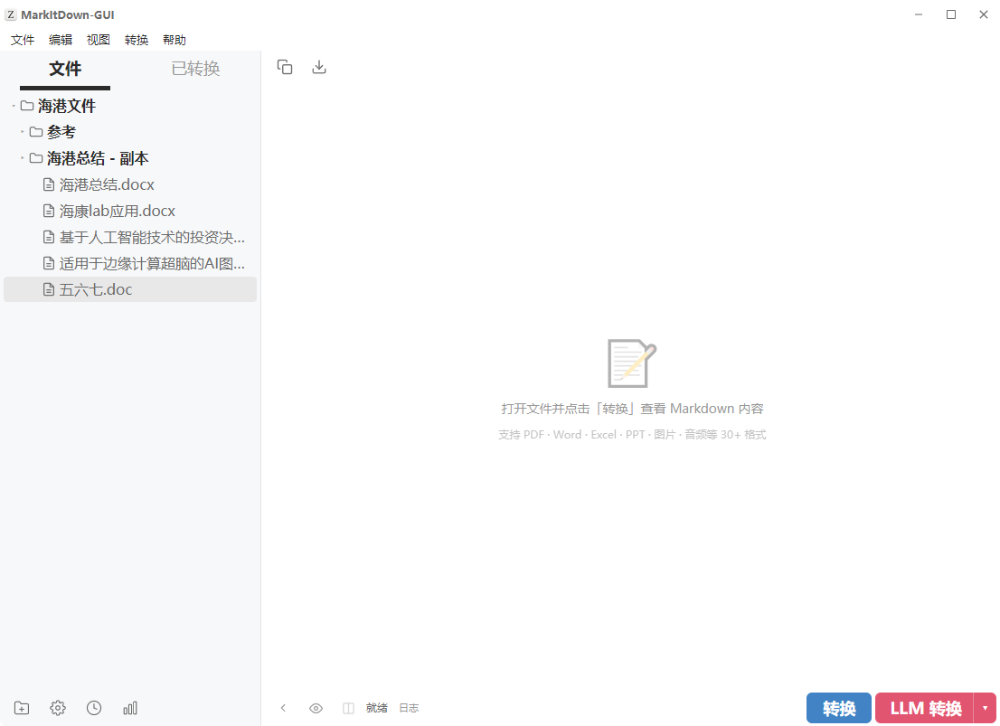
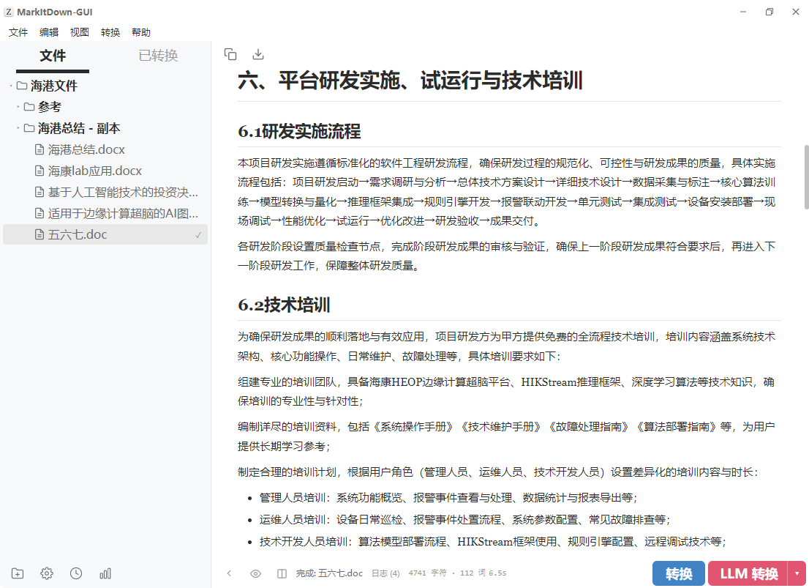
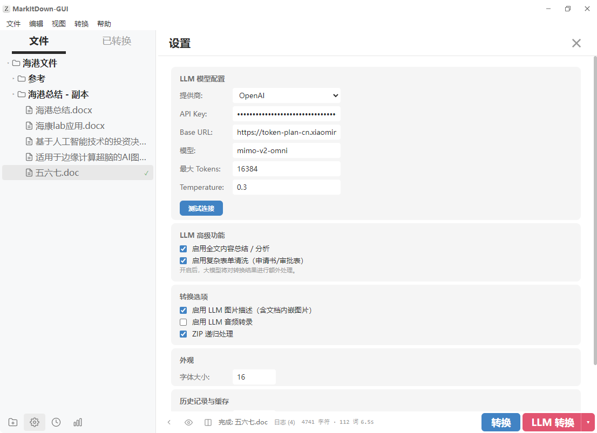
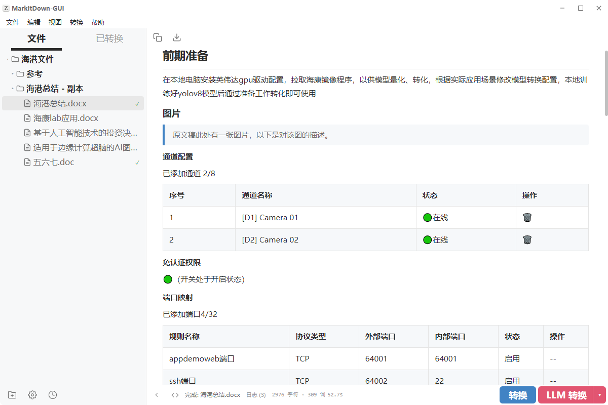
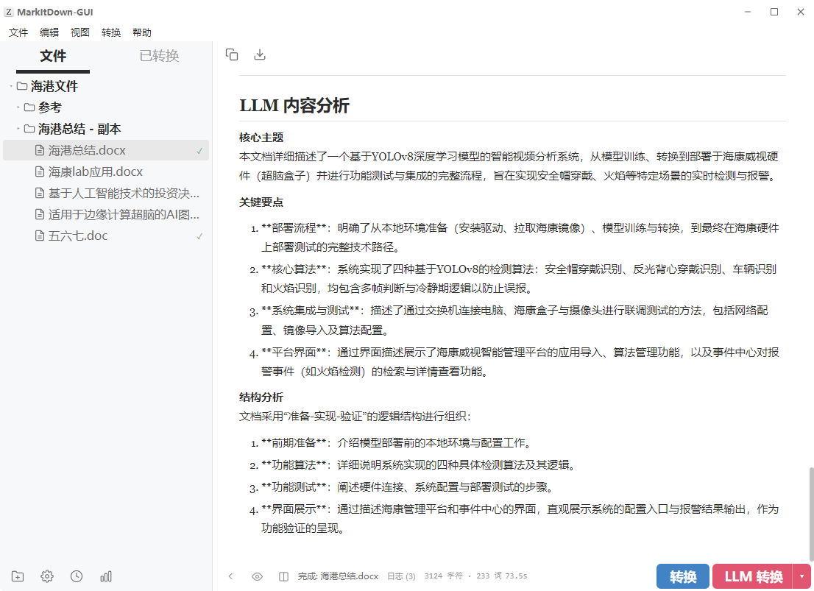
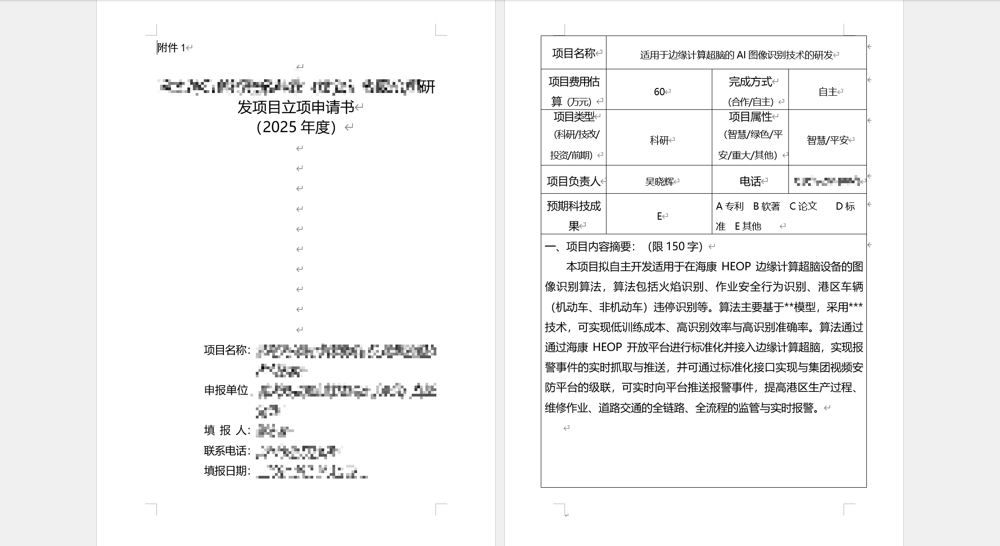
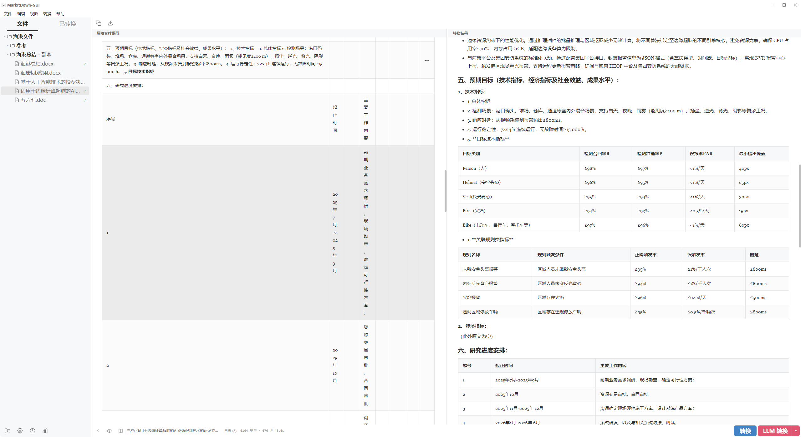

# MarkItDown GUI

文件转 Markdown 桌面工具，支持 LLM 增强处理。

作者：**JJCKA(ZBH)**

---

## 功能概览

### 核心转换

- **30+ 文件格式**：PDF、Word（.doc/.docx）、Excel、PPT、图片、音频、CSV、JSON、XML、HTML、Markdown、ZIP 等
- **批量转换**：多选文件一键转换，逐文件状态追踪
- **SSE 实时进度**：转换过程中实时显示进度条和日志

### LLM 增强

- **图片描述**：自动识别图片内容，生成文字描述（支持文档内嵌图片提取）
- **音频转录**：将音频文件转录为文字
- **全文总结**：对文档进行结构化分析，输出核心主题、关键要点、结构分析
- **复杂表单清洗**：将机器提取的格式混乱表格展平为结构清晰的 Markdown
- **OpenAI 兼容**：支持任何 OpenAI 兼容 API（OpenAI、DeepSeek、本地模型等）

### 界面特性

- **Typora 风格渲染**：深色代码块、表格斑马纹、任务列表复选框、图片居中阴影
- **三种视图模式**：预览（渲染效果）、源码（可编辑 Markdown）、对比（原始提取 vs 转换结果）
- **拖拽支持**：直接拖拽文件/文件夹到窗口打开
- **侧边栏文件树**：目录懒加载、SVG 文件图标、多选支持（Ctrl/Shift）
- **可调侧边栏**：拖拽分割线调整宽度，鼠标悬停高亮提示

### 数据管理

- **历史记录**：自动记录每次转换，显示文件名、时间戳、字符数、耗时、成功/失败状态
- **转换缓存**：转换结果自动缓存到单一 JSON 文件，支持配置最大缓存条数，点击历史记录直接查看结果（跨会话有效）
- **转换队列**：批量转换时显示队列面板，支持取消、重试、全部导出
- **转换统计**：总转换次数、总字符数、LLM 调用次数、成功率、平均耗时

### 导出与编辑

- **Markdown 源码编辑**：在源码模式下直接编辑转换结果，预览实时更新
- **导出 .md 文件**：通过保存对话框导出，编辑后的内容自动更新缓存
- **复制到剪贴板**：一键复制 Markdown 内容

---

## 软件截图

**主界面：**


**打开文件夹：**



**转换普通文本word文档：**



**设置界面：**



**LLM转换 - 描述图片 + 全文总结：**

内嵌描述图片：



全文总结：



**LLM转换 - 描述图片 + 复杂表单清洗：**

原始文件是申请表形式的，直接用MarkItDown转换后得到的是MarkDown的表格，观感很差。






- 左边是直接用MarkItDown转换后得到的MarkDown表格
- 右边是LLM处理后效果，可以把**项目内容摘要、创新点及技术关键等**内容提取为排版文本内容，而原本的**技术指标、进度安排等**仍保留表格格式。

---

## 技术栈

| 层 | 技术 |
|---|------|
| 桌面壳 | Electron |
| 前端 | React 18 + TypeScript + Zustand + marked |
| 后端 | Python 3.13 + FastAPI + markitdown + httpx |
| 打包 | PyInstaller + electron-builder |

---

## 开发环境

- Node.js >= 18
- Python >= 3.10

```bash
# 创建虚拟环境
python -m venv MDGUI
MDGUI\Scripts\activate

# 后端依赖
pip install -r requirements.txt

# 前端依赖
npm install

# 启动开发
npm run electron:dev
```

---

## 快捷键

| 快捷键 | 功能 |
|--------|------|
| `Ctrl+O` | 打开文件 |
| `Ctrl+Shift+O` | 打开文件夹 |
| `Ctrl+S` | 导出 Markdown |
| `Ctrl+Enter` | 普通转换 |
| `Ctrl+Shift+Enter` | LLM 转换 |
| `Ctrl+B` | 切换侧边栏 |
| `Ctrl+,` | 打开设置 |
| `Ctrl+H` | 历史记录 |
| `Ctrl+J` | 切换日志面板 |
| `Ctrl+Shift+V` | 切换对比视图 |
| `Escape` | 关闭弹窗 / 返回编辑器 |

---

## 配置

配置存储在 `~/.markitdown-ui/config.json`：

| 路径 | 说明 | 默认值 |
|------|------|--------|
| `llm.provider` | 提供商 | `openai` |
| `llm.api_key` | API 密钥 | 空 |
| `llm.base_url` | API 端点 | `https://api.openai.com/v1` |
| `llm.model` | 模型名称 | `gpt-4o` |
| `llm.max_tokens` | 最大 Tokens | `4096` |
| `llm.temperature` | 温度 | `0.3` |
| `conversion.enable_llm_image` | 图片描述 | `false` |
| `conversion.enable_llm_audio` | 音频转录 | `false` |
| `conversion.enable_summary` | 全文总结 | `false` |
| `conversion.enable_form_cleaning` | 表单清洗 | `false` |
| `cache.max_items` | 最大缓存条数 | `50` |

缓存文件：`~/.markitdown-ui/cache.json`

---

## 项目结构

```
markitdown-ui/
├── electron/                          # Electron 主进程
│   ├── main.ts                        #   窗口管理、Python 进程生命周期
│   └── preload.ts                     #   IPC 桥接，暴露安全的 electronAPI
│
├── src/                               # React 前端
│   ├── main.tsx                       #   入口，挂载 <App/>
│   ├── App.tsx                        #   根布局：标题栏+菜单+侧边栏+内容区+拖拽
│   ├── global.d.ts                    #   electronAPI 的 TypeScript 类型声明
│   ├── components/
│   │   ├── TitleBar.tsx               #   自定义标题栏（图标+标题+窗口控件）
│   │   ├── MenuBar.tsx                #   菜单栏（文件/编辑/视图/转换/帮助）
│   │   ├── Sidebar.tsx                #   侧边栏容器（标签+文件树+底部操作栏）
│   │   ├── FileTree.tsx               #   文件树（目录懒加载+SVG图标+多选）
│   │   ├── ConvertedList.tsx          #   已转换文件列表
│   │   ├── MilkdownEditor.tsx         #   Markdown 查看/编辑器（预览+源码+对比）
│   │   ├── SettingsPage.tsx           #   设置页（LLM配置+缓存设置+功能开关）
│   │   ├── HistoryPanel.tsx           #   历史记录面板（缓存状态+时间戳）
│   │   ├── StatsPanel.tsx             #   转换统计面板
│   │   ├── QueuePanel.tsx             #   转换队列面板（状态追踪+取消+导出）
│   │   ├── BottomBar.tsx              #   底部控制栏（状态/日志/进度/转换按钮）
│   │   ├── LogPanel.tsx               #   折叠日志面板
│   │   └── LLMPopup.tsx               #   LLM 功能快速开关弹窗
│   ├── stores/
│   │   └── appStore.ts                #   Zustand 全局状态
│   ├── api/
│   │   └── client.ts                  #   后端 API 客户端（HTTP + SSE）
│   ├── hooks/
│   │   └── useKeyboard.ts             #   全局键盘快捷键
│   ├── styles/
│   │   └── theme.css                  #   Typora 风格 CSS 主题
│   └── utils/
│       └── path.ts                    #   前端路径工具函数
│
├── backend/                           # Python FastAPI 后端
│   ├── main.py                        #   应用入口，注册路由，启动 uvicorn
│   ├── api/
│   │   ├── convert.py                 #   转换端点（/api/convert/*，含 SSE）
│   │   └── settings.py                #   设置端点（/api/settings/*）
│   ├── core/
│   │   ├── config.py                  #   JSON 持久化配置管理
│   │   ├── cache.py                   #   转换结果缓存管理
│   │   ├── converter.py               #   转换引擎（基础+LLM增强+图片提取+分块）
│   │   ├── llm_client.py              #   OpenAI 兼容 LLM API 客户端
│   │   └── doc_converter.py           #   .doc → .docx 转换（COM 自动化）
│   ├── prompts/
│   │   └── builtin.py                 #   LLM Prompt 模板+文件扩展名分类
│   └── tests/
│       ├── test_config.py             #   Config 单元测试
│       ├── test_converter.py          #   Converter 纯函数测试
│       └── test_prompts.py            #   Prompt/扩展名测试
│
├── assets/                            # 图标资源
├── screenshots/                       # 软件截图
├── DOC/                               # 项目文档
├── scripts/                           # 构建脚本
├── index.html                         # Vite 入口 HTML
├── package.json                       # Node.js 项目配置
├── tsconfig.json                      # TypeScript 配置
├── vite.config.ts                     # Vite 构建配置
├── electron-builder.yml               # Electron 打包配置
├── requirements.txt                   # Python 依赖列表
├── CHANGELOG.md                       # 更新日志
├── README.md                          # 本文件
├── LICENSE                            # MIT 开源协议
└── .gitignore                         # Git 忽略规则
```

---

## 打包

```bash
scripts\build.bat
```

产物在 `release/MarkItDown GUI x.x.x.exe`。

---

## 使用条款

- 本项目仅供个人学习、研究、非商业用途。未经作者许可，不得用于任何商业目的。
- 如需二次开发、修改或再发布，必须保留原始作者署名，并在衍生项目中注明来源。
- 界面视觉风格受 Typora 启发，所有代码均为独立编写，未使用 Typora 的源代码、资源或商标。
- 核心文件转换引擎由 [Microsoft markitdown](https://github.com/microsoft/markitdown) 提供（MIT License），Markdown 渲染由 [marked](https://github.com/markedjs/marked) 提供。

## 鸣谢

- [markitdown](https://github.com/microsoft/markitdown) — Microsoft 开源的文件转 Markdown 引擎
- [marked](https://github.com/markedjs/marked) — Markdown 解析与渲染库
- [React](https://react.dev) / [Electron](https://www.electronjs.org) / [FastAPI](https://fastapi.tiangolo.com) — 底层框架
- 界面设计灵感来自 [Typora](https://typora.io)

## 许可证

本项目代码采用 MIT License，见 [LICENSE](LICENSE) 文件。同时受上述「使用条款」约束：禁止商用，衍生作品须署名。
